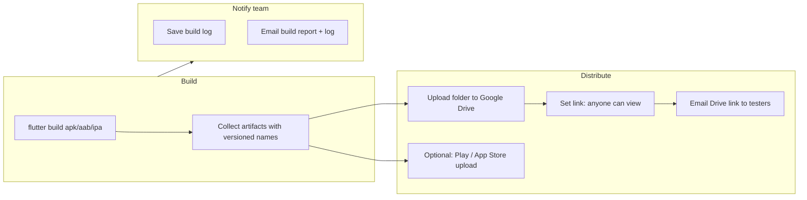

# Distribution — Usage & Delivery

Yeh guide batata hai ke **build artifacts testers / team tak kaise deliver hote hain** — Google Drive, email, aur store uploads. Internal folder paths ya app directory logic yahan cover nahi hai; focus sirf **flow, APIs, aur apne Flutter project mein yeh system kaise banao**.

Setup variables: [`ENVIRONMENT.md`](ENVIRONMENT.md)

---

## Delivery kya hai?

Release ke baad teen alag channels hain:

| Channel | Kya deliver hota hai | Kaun receive karta hai |
|:---|:---|:---|
| **Google Drive** | APK / AAB / IPA files + public folder link | Testers, QA, clients (link share) |
| **Email — Drive link** | HTML email: file list + “Open in Drive” button | `DISTRIBUTION` recipients |
| **Email — Build report** | HTML summary + step pass/fail + log attachment | `LOGS_DISTRIBUTION` recipients |
| **Play Store** | AAB → track (production / beta / …) | End users via Play Console |
| **App Store** | IPA → App Store Connect | End users via TestFlight / release |

Drive + emails = **internal / beta distribution**.  
Play / App Store = **public store release** (alag credentials, alag API).

---

## Poora delivery flow (concept)



**Idea:** pehle build karo, phir artifacts ko ek **staging set** (versioned filenames) banao, phir unhe cloud par daalo aur log / link se logon ko batao.

---

## Step 1 — Build artifacts collect karna

Flutter build ke baad yeh files milti hain:

| Platform | Command | Typical output |
|:---|:---|:---|
| Android APK | `flutter build apk --release --split-per-abi` | `build/app/outputs/flutter-apk/app-*-release.apk` |
| Android AAB | `flutter build appbundle --release` | `build/app/outputs/bundle/release/app-release.aab` |
| iOS IPA | `flutter build ipa --release` | `build/ios/ipa/*.ipa` |

**Delivery ke liye best practice:** in files ko **versioned names** se ek alag folder mein copy karo, taake har release clearly identify ho:

```
MyApp-v1.2.0+42.arm64-v8a.apk
MyApp-v1.2.0+42.aab
MyApp-v1.2.0+42.ipa
```

Version + build number `pubspec.yaml` se lo (`version: 1.2.0+42`).

Is repo mein yeh copy step build ke turant baad hoti hai; apne project mein yeh **shell script**, **GitHub Action**, ya **Dart script** se kar sakte ho — zaroori yeh hai ke upload step ko **ek fixed list of files** mile.

---

## Step 2 — Google Drive par deliver karna

### Auth

- **OAuth Desktop client** (user account) — personal / team Drive folder ke liye.
- GCP: Drive API enable → Credentials → OAuth client (Desktop) → JSON download.
- Pehli dafa browser se authorize → **refresh token** save karo; baad ki runs automatic.

Scope: `https://www.googleapis.com/auth/drive`

### Upload algorithm (replicate karne ke liye)

1. Staging folder ki **saari files** list karo.
2. Drive par folder banao: `{AppName} v{version}+{build}`.
3. *(Optional)* same name ka purana folder parent ke andar delete karo — taake duplicate na rahein.
4. Har file **resumable upload** se upload karo (badi APK/IPA ke liye zaroori).
5. Folder par permission: `type: anyone`, `role: reader` → **link se view**.
6. Link: `https://drive.google.com/drive/folders/{folderId}`

### MIME types

| Extension | MIME |
|:---|:---|
| `.apk` | `application/vnd.android.package-archive` |
| `.aab`, `.ipa` | `application/octet-stream` |

### Required config (secrets)

| Key | Purpose |
|:---|:---|
| OAuth client JSON | Drive login |
| Saved token JSON | Repeat runs without browser |
| Parent folder ID *(optional)* | Sab uploads ek shared Drive folder ke andar |

Agar credentials missing hon to upload **skip** ho sakta hai (pipeline rukti nahi); auth fail par step **fail**.

---

## Step 3 — Email se deliver karna

Saari emails **Gmail SMTP** se:

- Host: `smtp.gmail.com:587` (STARTTLS)
- `GMAIL_USER` + `GMAIL_APP_PASSWORD` ([app password](https://myaccount.google.com/apppasswords))

### Do alag emails — alag audience

| | **Drive link email** | **Build report email** |
|:---|:---|:---|
| **Kab** | Drive upload success ke baad | Har build run ke end (pass / fail / stop) |
| **Recipients** | `DISTRIBUTION` (+ run-time extra list) | `LOGS_DISTRIBUTION` |
| **Content** | Uploaded files ki list + Drive button | Status, version, har step ka result, timing |
| **Attachment** | Nahi | Haan — full text log |

**Testers** → Drive link email (download / install).  
**Dev team** → build report (debugging, CI visibility).

Recipients JSON arrays mein store karo, e.g. `secrets/enviroment.json`:

```json
{
  "DISTRIBUTION": ["tester1@gmail.com", "qa@company.com"],
  "LOGS_DISTRIBUTION": ["dev@company.com"],
  "GMAIL_USER": "you@gmail.com",
  "GMAIL_APP_PASSWORD": "xxxx xxxx xxxx xxxx"
}
```

### Drive link email — kya bhejna hai

- Subject: `📦 Build Ready v1.2.0+42 — Download Link`
- Body (HTML): app name, version, uploaded file names, prominent Drive link
- Note: “Anyone with the link can view”

### Build report email — kya bhejna hai

- Subject: `✓ MyApp v1.2.0+42 — Build Report` (ya ✗ agar fail)
- Body: platforms, total time, table — har step Passed / Failed + duration
- Attach: `build_v1.2.0+42_2026-06-21_14-30-00.txt` (console log)

Gmail configure na ho to **log file local save** hoti rehti hai; email skip.

---

## Step 4 — Store par deliver karna *(optional)*

### Google Play

- **Service account** JSON (OAuth user nahi).
- API: `androidpublisher` v3 — edit create → AAB upload → track assign → commit.
- Track: `production` | `beta` | `alpha` | `internal`
- Source: pehla `*.aab` build output se (staging folder zaroori nahi).

### App Store Connect *(Mac)*

- API key (`.p8`) + Issuer ID + Key ID.
- Tool: `xcrun altool --upload-app` ya Transporter.
- Source: pehla `*.ipa`.

Store uploads **Drive se independent** hain — alag credentials, seedha Flutter build paths se.

---

## Apne Flutter project mein kaise banao

### Option A — CI pipeline (recommended)

GitHub Actions / Codemagic / Bitrise:

```yaml
# Conceptual steps
- flutter build apk --release
- flutter build appbundle --release
# Copy + rename artifacts
- run: upload-to-drive script   # Python / Node / gcloud
- run: send-email script        # SMTP or SendGrid
```

Secrets: `GDRIVE_*`, `GMAIL_*`, `DISTRIBUTION`, `LOGS_DISTRIBUTION` as repo secrets.

### Option B — Local script after build

`scripts/release.sh`:

```bash
VERSION=$(grep '^version:' pubspec.yaml | awk '{print $2}')
flutter build apk --release --split-per-abi
flutter build appbundle --release
mkdir -p dist
cp build/app/outputs/flutter-apk/*.apk dist/
cp build/app/outputs/bundle/release/*.aab dist/
python tools/upload_drive.py dist/ "$VERSION"
python tools/send_report.py --success
```

### Option C — Pure Dart *(limited)*

- **Email:** `mailer` package + Gmail app password — theek hai.
- **Drive:** official Dart client kam common; practical options:
  - `Process.run` se Python/Node upload script
  - REST calls with `googleapis` + OAuth (more setup)
  - CI par offload karo

### Minimum viable delivery (copy-paste pattern)

1. **Build** → Flutter CLI  
2. **Stage** → versioned files in `dist/`  
3. **Upload** → Drive API: create folder → upload files → share link  
4. **Notify testers** → SMTP HTML email with link + file list  
5. **Notify team** → SMTP HTML report + log attachment (always, even on failure)

Yahi pattern is repo ka `drive_upload` + `build_report` follow karta hai.

---

## APIs & packages summary

| Job | Service | Auth | This repo |
|:---|:---|:---|:---|
| File hosting + link | Google Drive API v3 | OAuth Desktop user | `helpers/drive_upload.py` |
| Tester notification | Gmail SMTP | App password | `send_drive_link_email()` |
| Team notification | Gmail SMTP | App password | `send_build_report()` |
| Play release | Android Publisher API | Service account | `helpers/google_play_upload.py` |
| iOS release | App Store Connect | API key + altool | `core/run.py` |

---

## User-facing usage (is tool se)

### GUI

1. **Distribution** tab: `Upload to Drive` on karo.  
2. Recipient checkboxes / extra emails set karo (Drive link ke liye).  
3. **Settings → Environment:** Drive OAuth JSON, Gmail, `DISTRIBUTION`, `LOGS_DISTRIBUTION`.  
4. Pipeline run karo — console par public link dikhega; emails auto jayengi agar configured hon.

### CLI

```bash
python run.py --recipients "tester@mail.com,qa@mail.com"
```

`--recipients` = sirf Drive link email. Build report hamesha `LOGS_DISTRIBUTION` par.

---

## Typical release scenario

1. Build APK + AAB (version `1.2.0+42`).  
2. Artifacts versioned names ke saath staging folder mein.  
3. Drive: folder `MyApp v1.2.0+42` → sab files upload → public link.  
4. Email to testers: link + file list (`DISTRIBUTION`).  
5. Pipeline khatam → email to devs: pass/fail report + log (`LOGS_DISTRIBUTION`).  
6. *(Optional)* AAB Play internal track par; IPA TestFlight par.

**Outcome:** testers ko install karne ke liye Drive link; team ko audit trail; stores par public release alag step se.

---

## Checklist — apna system banate waqt

- [ ] GCP project: Drive API + OAuth Desktop client  
- [ ] Gmail app password for sending  
- [ ] Recipient lists: testers vs dev team (do alag lists)  
- [ ] Post-build script: copy + rename artifacts  
- [ ] Drive upload: folder per release, anyone-with-link read  
- [ ] Email on upload success (link + filenames)  
- [ ] Email on every run end (report + log), success ya fail  
- [ ] *(Optional)* Play service account + App Store API key  

---

## Common issues

| Problem | Fix |
|:---|:---|
| Drive link email nahi gayi | `DISTRIBUTION` khali ya Gmail missing |
| Build report nahi aaya | `LOGS_DISTRIBUTION` khali ya Gmail missing |
| Drive par kuch nahi | Build/copy step fail; staging folder khali |
| Link open nahi hota | Folder permission `anyone` / `reader` set karo |
| Play upload fail | Service account Play Console mein linked + Release Manager |
